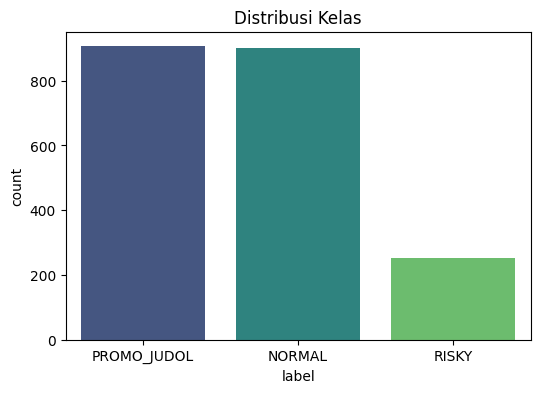
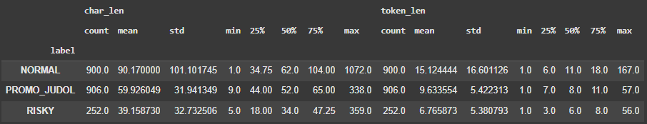

## 🇬🇧 English Version
## 📊 Class Distribution

The dataset consists of three main categories with two dominant classes and one significantly smaller minority class:

* **PROMO\_JUDOL** : 906 samples
* **NORMAL** : 900 samples
* **RISKY** : 252 samples

This indicates that the dataset is **not fully balanced**, with *RISKY* being a minority class.

---

## 📈 Text Length Statistics per Class

Descriptive statistics of text length (both characters and tokens) provide insights into content variation across classes.

* **NORMAL** → \~90 characters, \~15 tokens (high variation, up to 1072 chars)
* **PROMO\_JUDOL** → \~60 characters, \~10 tokens (shorter, more concise)
* **RISKY** → \~39 characters, \~7 tokens (mostly short, some long outliers)

🔎 **Key Notes**:

* Length variation may affect NLP model performance.
* Techniques like **resampling**, **data augmentation**, or **architecture adjustments** may be required.

---

# 🇮🇩 Versi Bahasa Indonesia 

## 📊 Distribusi Kelas

Dataset terdiri dari tiga kategori utama dengan dua kelas dominan serta satu kelas minoritas:

* **PROMO\_JUDOL** : 906 sampel
* **NORMAL** : 900 sampel
* **RISKY** : 252 sampel

Dataset ini **tidak sepenuhnya seimbang**, karena *RISKY* memiliki jumlah data jauh lebih sedikit.

---

## 📈 Statistik Panjang Teks per Kelas

Statistik panjang teks (karakter & token) menggambarkan variasi konten pada tiap kelas:

* **NORMAL** → ±90 karakter, ±15 token (variatif, hingga 1072 karakter)
* **PROMO\_JUDOL** → ±60 karakter, ±10 token (lebih singkat & padat)
* **RISKY** → ±39 karakter, ±7 token (cenderung pendek, ada outlier panjang)

🔎 **Catatan Penting**:

* Perbedaan distribusi panjang teks antar kelas dapat memengaruhi performa NLP.
* Perlu strategi seperti **resampling**, **augmentasi data**, atau **penyesuaian model**.

