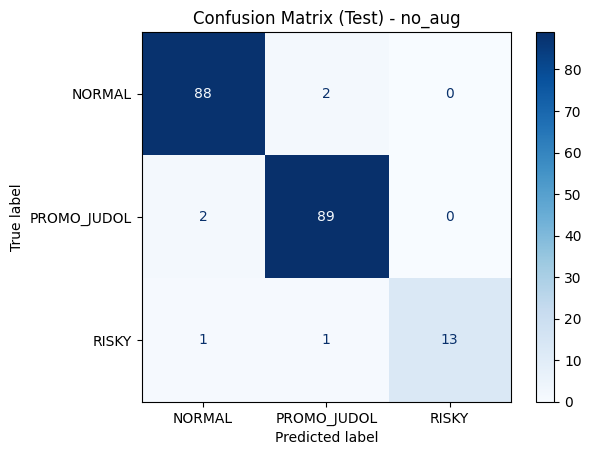
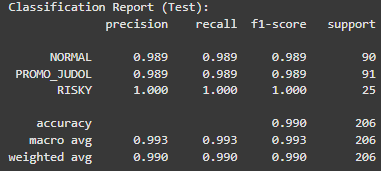
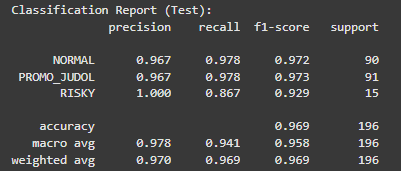

This folder contains experiments using **IndoBERTweet**, a pre-trained transformer model tailored for Indonesian Twitter text, fine-tuned for comment classification. Two experimental setups were compared:

1. **Without Augmentation** — trained only on original (real) data.
2. **With Augmentation** — trained on both original and augmented data, specifically to strengthen the minority class (*RISKY*).

The results include:

* Jupyter/Colab notebook for training (`indobertweet.ipynb`)
* Demo notebook for inference (`demo_indoBERTweet.ipynb`)
* Confusion matrix visualizations (with & without augmentation)
* Evaluation reports (precision, recall, f1-score, and accuracy)

---

## 📊 Confusion Matrix

Below are the confusion matrices obtained from the test sets.

### 🔹 With Augmentation

### 🔹 Without Augmentation

---

## 📈 Evaluation Reports

The classification performance is evaluated on both **validation** and **test** sets. Metrics include precision, recall, f1-score, and accuracy.

### 🔹 With Augmentation

**Key Insights**

* Achieved **99.0% test accuracy**.
* Balanced performance across all three classes (*NORMAL*, *PROMO\_JUDOL*, *RISKY*).
* *RISKY* class detected perfectly (precision: 1.00, recall: 1.00).

---

### 🔹 Without Augmentation

**Key Insights**

* Achieved **96.9% test accuracy**.
* Performance slightly lower compared to the augmentation scenario.
* Recall for *RISKY* class dropped to **0.87**, indicating less robust detection.

---

## 🧪 Demo Predictions

The model was tested on unseen YouTube comments to validate real-world usability.

* **Comment**: `Kapan lagi bisa kaya, yokk bisa join langsung di nickame ini yah. di jamin cepat kaya! no hoax`
  → **Prediction**: `PROMO_JUDOL` (probability: 0.9981)

* **Comment**: `banyak amat komentar judi nya, hapusin dong youtube`
  → **Prediction**: `RISKY` (probability: 0.9953)

* **Comment**: `bangg main ke banjar yook, biar di traktir`
  → **Prediction**: `NORMAL` (probability: 0.9947)

---

## ⚖️ Conclusion

Fine-tuned **IndoBERTweet** significantly outperforms the baseline TF-IDF + Logistic Regression model, especially when data augmentation is applied.
The model demonstrates strong robustness in detecting promotional gambling content, with near-perfect results across all classes when augmentation is included.

---

# ID

---

Folder ini berisi eksperimen menggunakan **IndoBERTweet**, sebuah model transformer pra-latih untuk teks bahasa Indonesia, yang di-*fine-tune* untuk klasifikasi komentar. Dua skenario pelatihan dibandingkan:

1. **Tanpa Augmentasi** — hanya menggunakan data asli.
2. **Dengan Augmentasi** — menggunakan data asli dan data hasil augmentasi, khusus untuk memperkuat kelas minoritas (*RISKY*).

Hasil yang tersedia meliputi:

* Notebook pelatihan (`indobertweet.ipynb`)
* Notebook demo (`demo_indoBERTweet.ipynb`)
* Visualisasi confusion matrix (dengan & tanpa augmentasi)
* Laporan evaluasi (precision, recall, f1-score, dan accuracy)

---

## 📊 Confusion Matrix

Berikut adalah confusion matrix dari hasil pengujian model.

### 🔹 Dengan Augmentasi

### 🔹 Tanpa Augmentasi

---

## 📈 Laporan Evaluasi

Kinerja klasifikasi dievaluasi pada **validation set** dan **test set**. Metrik yang digunakan meliputi precision, recall, f1-score, dan accuracy.

### 🔹 Dengan Augmentasi

**Wawasan Utama**

* Mencapai **99.0% akurasi pada test set**.
* Performa antar kelas seimbang (*NORMAL*, *PROMO\_JUDOL*, *RISKY*).
* Kelas *RISKY* terdeteksi sempurna (precision: 1.00, recall: 1.00).

---

### 🔹 Tanpa Augmentasi

**Wawasan Utama**

* Mencapai **96.9% akurasi pada test set**.
* Performa sedikit menurun dibandingkan skenario augmentasi.
* Recall kelas *RISKY* turun ke **0.87**, menunjukkan deteksi kurang stabil.

---

## 🧪 Demo Prediksi

Model diuji pada komentar YouTube baru untuk memvalidasi kegunaan di dunia nyata.

* **Komentar**: `Kapan lagi bisa kaya, yokk bisa join langsung di nickame ini yah. di jamin cepat kaya! no hoax`
  → **Prediksi**: `PROMO_JUDOL` (probabilitas: 0.9981)

* **Komentar**: `banyak amat komentar judi nya, hapusin dong youtube`
  → **Prediksi**: `RISKY` (probabilitas: 0.9953)

* **Komentar**: `bangg main ke banjar yook, biar di traktir`
  → **Prediksi**: `NORMAL` (probabilitas: 0.9947)

---

## ⚖️ Kesimpulan

Model **IndoBERTweet** yang di-*fine-tune* menunjukkan performa jauh lebih baik dibanding baseline TF-IDF + Logistic Regression, terutama dengan penggunaan augmentasi data.
Model ini sangat andal dalam mendeteksi komentar promosi judi online, dengan hasil hampir sempurna di semua kelas pada skenario augmentasi.

---
