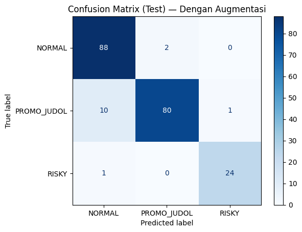
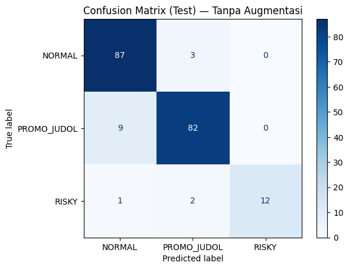

This folder contains experiments using **TF-IDF features combined with Logistic Regression** as a baseline model for text classification. Two experimental setups were compared:

1. **Without Augmentation** — trained only on original (real) data.
2. **With Augmentation** — trained on both original and augmented data.

The results include:

* Jupyter/Colab notebook (`Baseline_tfidf_lr_compare_aug.ipynb`)
* Confusion matrix visualizations (with & without augmentation)
* Evaluation reports (precision, recall, f1-score, and accuracy)

---

## 📊 Confusion Matrix

Below are the confusion matrices obtained from the test sets.

### 🔹 With Augmentation

### 🔹 Without Augmentation

---

## 📈 Evaluation Reports

The classification performance is evaluated on both **validation** and **test** sets. Metrics include precision, recall, f1-score, and accuracy.

### 🔹 With Augmentation

**Key Insights**

* Achieved **93.2% test accuracy**.
* Balanced performance between *NORMAL* and *PROMO\_JUDOL* classes.
* *RISKY* class well-detected (precision: 0.96, recall: 0.96).

---

### 🔹 Without Augmentation

**Key Insights**

* Achieved **92.3% test accuracy**.
* Performance slightly lower compared to augmentation scenario.
* *RISKY* class recall dropped to **0.80**, indicating less robust detection.

---

## ⚖️ Conclusion

Data augmentation improved the model’s robustness, especially for minority classes such as *RISKY*. While both setups performed well, the augmented dataset achieved slightly higher accuracy and more consistent performance across all classes.

---

# 📄 Ringkasan dalam Bahasa Indonesia

---

Folder ini berisi eksperimen menggunakan **TF-IDF dan Logistic Regression** sebagai baseline untuk klasifikasi teks. Dua skenario pelatihan dibandingkan:

1. **Tanpa Augmentasi** — hanya menggunakan data asli.
2. **Dengan Augmentasi** — menggunakan data asli dan hasil augmentasi.

Hasil yang tersedia meliputi:

* Notebook Jupyter/Colab (`Baseline_tfidf_lr_compare_aug.ipynb`)
* Visualisasi confusion matrix (dengan & tanpa augmentasi)
* Laporan evaluasi (precision, recall, f1-score, dan accuracy)

---

## 📊 Confusion Matrix

Berikut adalah confusion matrix dari hasil pengujian model.

### 🔹 Dengan Augmentasi

### 🔹 Tanpa Augmentasi

---

## 📈 Laporan Evaluasi

Kinerja klasifikasi dievaluasi pada **validation set** dan **test set**. Metrik yang digunakan meliputi precision, recall, f1-score, dan accuracy.

### 🔹 Dengan Augmentasi

**Wawasan Utama**

* Mencapai **93.2% akurasi pada test set**.
* Kinerja kelas *NORMAL* dan *PROMO\_JUDOL* relatif seimbang.
* Kelas *RISKY* terdeteksi baik (precision: 0.96, recall: 0.96).

---

### 🔹 Tanpa Augmentasi

**Wawasan Utama**

* Mencapai **92.3% akurasi pada test set**.
* Performa sedikit lebih rendah dibandingkan skenario dengan augmentasi.
* Recall kelas *RISKY* turun ke **0.80**, menunjukkan deteksi kurang stabil.

---

## ⚖️ Kesimpulan

Augmentasi data meningkatkan ketahanan model, terutama pada kelas minoritas seperti *RISKY*. Meskipun kedua skenario menunjukkan performa baik, penggunaan augmentasi memberikan akurasi sedikit lebih tinggi serta hasil yang lebih konsisten di semua kelas.

---

Apakah Anda ingin saya tambahkan **tabel ringkas perbandingan metrik utama (akurasi, macro avg f1)** agar lebih mudah dibaca cepat, Sir?

