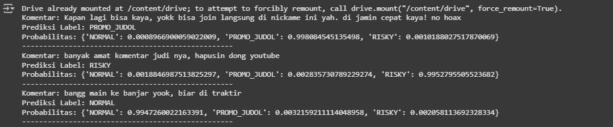

## EN

This folder contains the result and **demo environment** for the fine-tuned **IndoBERTweet** model trained on the augmented dataset.
Due to large file size, the full model artifacts are **not uploaded to GitHub** but are accessible via Google Drive:
[🔗 Download Model Artifacts](https://drive.google.com/drive/folders/1wR184orAxaicI8yyW7F_XDI--nQiNEWV?usp=sharing)

Available files in this folder:

* `demo_indoBERTweet.ipynb` → notebook demo for inference on new comments
* `demo_indobertweet.png` → sample output preview

Model artifacts (stored externally in Google Drive):

* `config.json`
* `model.safetensors`
* `special_tokens_map.json`
* `tokenizer_config.json`
* `tokenizer.json`
* `vocab.txt`
* *(training\_args.bin is included but only for reproducibility, not required for inference)*

---

## ⚙️ Demo Environment

The demo shows how to load the fine-tuned IndoBERTweet model and tokenizer, run inference on new comments, and generate predictions.

---

## 🧪 Demo Input

Three example comments were tested:

```python
new_comments = [
    "Kapan lagi bisa kaya, yokk bisa join langsung di nickame ini yah. di jamin cepat kaya! no hoax",
    "banyak amat komentar judi nya, hapusin dong youtube",
    "bangg main ke banjar yook, biar di traktir"
]
```

---

## 📊 Demo Results

### 🔹 Output Preview



### 🔹 Predictions

1. **Comment**:
   *Kapan lagi bisa kaya, yokk bisa join langsung di nickame ini yah. di jamin cepat kaya! no hoax*
   **Prediction**: PROMO\_JUDOL
   **Probabilities**: NORMAL (0.0009), PROMO\_JUDOL (0.9981), RISKY (0.0010)

2. **Comment**:
   *banyak amat komentar judi nya, hapusin dong youtube*
   **Prediction**: RISKY
   **Probabilities**: NORMAL (0.0019), PROMO\_JUDOL (0.0028), RISKY (0.9953)

3. **Comment**:
   *bangg main ke banjar yook, biar di traktir*
   **Prediction**: NORMAL
   **Probabilities**: NORMAL (0.9947), PROMO\_JUDOL (0.0032), RISKY (0.0021)

---

## ⚖️ Conclusion

The demo confirms that the exported IndoBERTweet model is functioning properly. The predictions align with expectations: promotional/gambling-related text is classified as *PROMO\_JUDOL* or *RISKY*, while casual/non-risky text is classified as *NORMAL*.
The complete model artifacts are hosted on Google Drive due to size limitations.

---

## ID

Folder ini berisi hasil dan **lingkungan demo** untuk model **IndoBERTweet** yang telah di-*fine-tune* menggunakan dataset dengan augmentasi.
Karena ukuran file model yang sangat besar, artefak lengkap tidak di-*upload* ke GitHub, tetapi tersedia melalui Google Drive:
[🔗 Unduh Artefak Model](https://drive.google.com/drive/folders/1wR184orAxaicI8yyW7F_XDI--nQiNEWV?usp=sharing)

File yang tersedia di folder ini:

* `demo_indoBERTweet.ipynb` → notebook demo untuk inference pada komentar baru
* `demo_indobertweet.png` → cuplikan hasil keluaran

Artefak model (tersimpan di Google Drive):

* `config.json`
* `model.safetensors`
* `special_tokens_map.json`
* `tokenizer_config.json`
* `tokenizer.json`
* `vocab.txt`
* *(training\_args.bin disertakan, tetapi hanya untuk replikasi, tidak wajib saat inference)*

---

## ⚙️ Lingkungan Demo

Lingkungan demo memperlihatkan bagaimana cara memuat IndoBERTweet yang telah di-*fine-tune*, melakukan inference pada komentar baru, dan menghasilkan prediksi.

---

## 🧪 Input Demo

Tiga komentar contoh digunakan untuk pengujian:

```python
new_comments = [
    "Kapan lagi bisa kaya, yokk bisa join langsung di nickame ini yah. di jamin cepat kaya! no hoax",
    "banyak amat komentar judi nya, hapusin dong youtube",
    "bangg main ke banjar yook, biar di traktir"
]
```

---

## 📊 Hasil Demo

### 🔹 Cuplikan Output


### 🔹 Prediksi

1. **Komentar**:
   *Kapan lagi bisa kaya, yokk bisa join langsung di nickame ini yah. di jamin cepat kaya! no hoax*
   **Prediksi**: PROMO\_JUDOL
   **Probabilitas**: NORMAL (0.0009), PROMO\_JUDOL (0.9981), RISKY (0.0010)

2. **Komentar**:
   *banyak amat komentar judi nya, hapusin dong youtube*
   **Prediksi**: RISKY
   **Probabilitas**: NORMAL (0.0019), PROMO\_JUDOL (0.0028), RISKY (0.9953)

3. **Komentar**:
   *bangg main ke banjar yook, biar di traktir*
   **Prediksi**: NORMAL
   **Probabilitas**: NORMAL (0.9947), PROMO\_JUDOL (0.0032), RISKY (0.0021)

---

## ⚖️ Kesimpulan

Demo ini membuktikan bahwa model IndoBERTweet hasil *fine-tuning* berjalan dengan baik. Prediksi sesuai ekspektasi: teks bernuansa promosi/judi terklasifikasi sebagai *PROMO\_JUDOL* atau *RISKY*, sedangkan teks santai/non-risiko diklasifikasikan sebagai *NORMAL*.
Artefak model lengkap disediakan melalui Google Drive karena keterbatasan ukuran file di GitHub.


