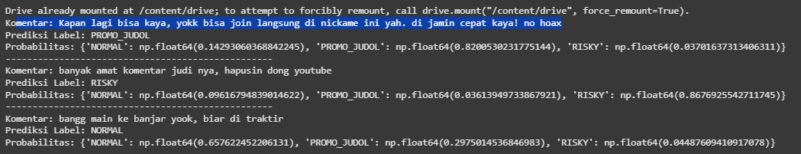

## EN

This folder contains the exported artifacts from the **TF-IDF + Logistic Regression** baseline model trained with augmentation. These artifacts allow for easy reloading and inference without retraining the model.

Exported artifacts:

* `logreg_model_with_aug.joblib` → Trained Logistic Regression model
* `tfidf_word_vectorizer_with_aug.joblib` → Word-level TF-IDF vectorizer
* `tfidf_char_vectorizer_with_aug.joblib` → Character-level TF-IDF vectorizer

---

## ⚙️ Demo Environment

The demo environment shows how to load the model and vectorizers, transform new comments, and generate predictions. The demo can be found in:

* `demo_TFIDF.ipynb` → notebook implementation
* `demo_tfidf.png` → sample output

---

## 🧪 Demo Input

Three example comments were tested:

```python
new_comments = [
    "Kapan lagi bisa kaya, yokk bisa join langsung di nickame ini yah. di jamin cepat kaya! no hoax",
    "banyak amat komentar judi nya, hapusin dong youtube",
    "bangg main ke banjar yook, biar di traktir"
]
```

---

## 📊 Demo Results

### 🔹 Output Preview



### 🔹 Predictions

1. **Comment**:
   *Kapan lagi bisa kaya, yokk bisa join langsung di nickame ini yah. di jamin cepat kaya! no hoax*
   **Prediction**: PROMO\_JUDOL
   **Probabilities**: NORMAL (0.14), PROMO\_JUDOL (0.82), RISKY (0.04)

2. **Comment**:
   *banyak amat komentar judi nya, hapusin dong youtube*
   **Prediction**: RISKY
   **Probabilities**: NORMAL (0.10), PROMO\_JUDOL (0.04), RISKY (0.87)

3. **Comment**:
   *bangg main ke banjar yook, biar di traktir*
   **Prediction**: NORMAL
   **Probabilities**: NORMAL (0.66), PROMO\_JUDOL (0.30), RISKY (0.04)

---

## ⚖️ Conclusion

The demo confirms that the exported model and vectorizers are functioning properly. The predictions align with expectations: promotional/gambling-related text is classified as *PROMO\_JUDOL* or *RISKY*, while casual/non-risky text is classified as *NORMAL*.

---

## ID

Folder ini berisi artefak hasil ekspor dari model **TF-IDF + Logistic Regression** yang telah dilatih dengan augmentasi. Artefak ini memungkinkan proses *inference* tanpa perlu melatih ulang model.

Artefak yang tersedia:

* `logreg_model_with_aug.joblib` → Model Logistic Regression hasil pelatihan
* `tfidf_word_vectorizer_with_aug.joblib` → TF-IDF vectorizer berbasis kata
* `tfidf_char_vectorizer_with_aug.joblib` → TF-IDF vectorizer berbasis karakter

---

## ⚙️ Lingkungan Demo

Lingkungan demo ini memperlihatkan bagaimana cara memuat model dan vectorizer, melakukan transformasi pada komentar baru, serta menghasilkan prediksi. Demo tersedia di:

* `demo_TFIDF.ipynb` → implementasi dalam notebook
* `demo_tfidf.png` → hasil keluaran contoh

---

## 🧪 Input Demo

Tiga komentar contoh digunakan untuk pengujian:

```python
new_comments = [
    "Kapan lagi bisa kaya, yokk bisa join langsung di nickame ini yah. di jamin cepat kaya! no hoax",
    "banyak amat komentar judi nya, hapusin dong youtube",
    "bangg main ke banjar yook, biar di traktir"
]
```

---

## 📊 Hasil Demo

### 🔹 Cuplikan Output


### 🔹 Prediksi

1. **Komentar**:
   *Kapan lagi bisa kaya, yokk bisa join langsung di nickame ini yah. di jamin cepat kaya! no hoax*
   **Prediksi**: PROMO\_JUDOL
   **Probabilitas**: NORMAL (0.14), PROMO\_JUDOL (0.82), RISKY (0.04)

2. **Komentar**:
   *banyak amat komentar judi nya, hapusin dong youtube*
   **Prediksi**: RISKY
   **Probabilitas**: NORMAL (0.10), PROMO\_JUDOL (0.04), RISKY (0.87)

3. **Komentar**:
   *bangg main ke banjar yook, biar di traktir*
   **Prediksi**: NORMAL
   **Probabilitas**: NORMAL (0.66), PROMO\_JUDOL (0.30), RISKY (0.04)

---

## ⚖️ Kesimpulan

Demo ini membuktikan bahwa model dan vectorizer hasil ekspor berjalan dengan baik. Prediksi sesuai ekspektasi: teks bernuansa promosi/judi terklasifikasi sebagai *PROMO\_JUDOL* atau *RISKY*, sedangkan teks santai/non-risiko diklasifikasikan sebagai *NORMAL*.


